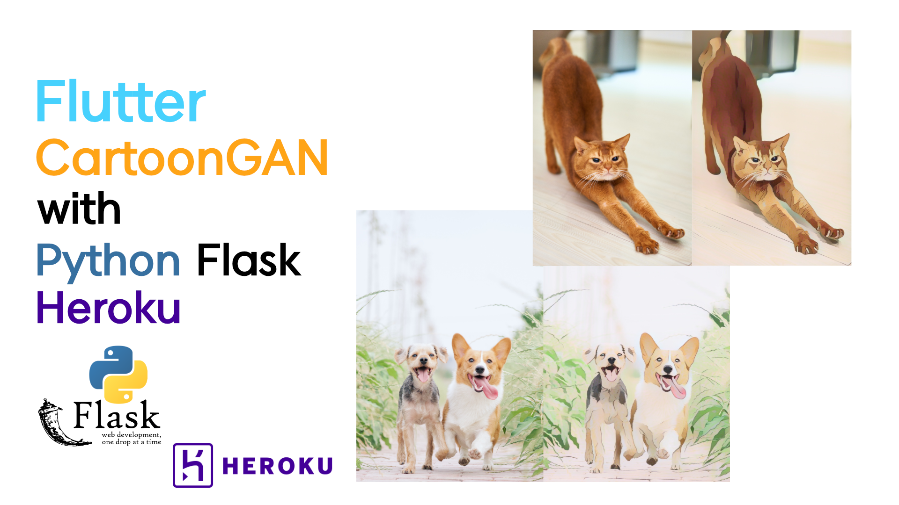

# Flutter CartoonGAN with Python Flask, Heroku
I made a machine learning API server using Python Flask. And I deployed API using Heroku free service.

 

## Youtube
[Flutter CartoonGAN with Python Flask, Heroku - SpeedCode](https://youtu.be/kxh9BHfkD2A)

 

## Github (Python Flask)
- https://github.com/PuzzleLeaf/tensorflow_flask_api_server

## Server API
- https://puzzleleaf-ml-server.herokuapp.com/v1/image/convert_cartoon

## Python Flask
- https://pythonbasics.org/what-is-flask-python/
Flask is a web framework, it’s a Python module that lets you develop web applications easily.

## Heroku
- https://www.heroku.com/
Heroku is a container-based cloud Platform as a Service (PaaS).
Developers use Heroku to deploy, manage, and scale modern apps.

## Keyword
CartoonGAN, Python, Flask, Heroku, Flutter, Tensorflow
